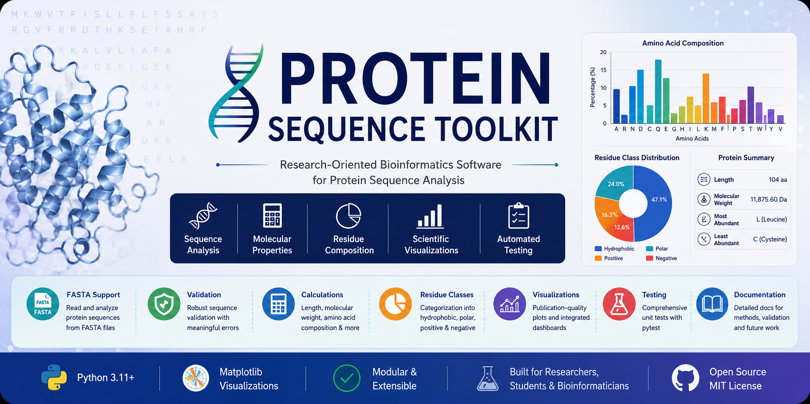
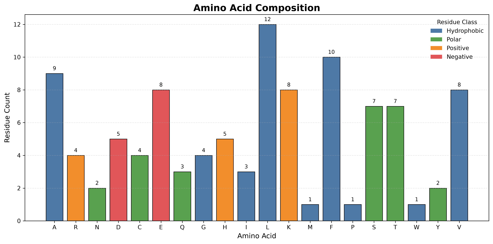
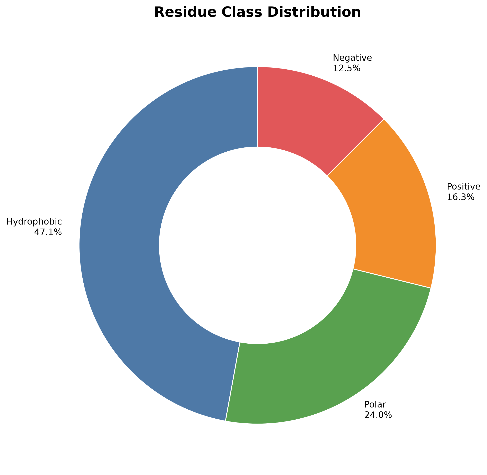
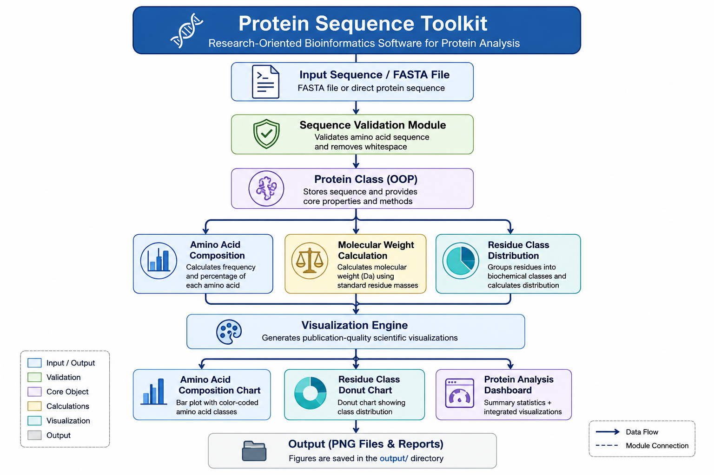

<p align="center">
  
</p>

<h1 align="center">🧬 Protein Sequence Toolkit</h1>

<p align="center">
Research-Oriented Bioinformatics Software for Protein Sequence Analysis
</p>

<p align="center">


</p>

---

# Overview

Protein sequence analysis is one of the first computational steps performed before many experimental workflows in molecular biology, biochemistry, and structural biology.

Researchers routinely analyze amino acid composition, molecular weight, and residue characteristics before protein expression, purification, structural characterization, and functional studies.

The **Protein Sequence Toolkit** is a research-oriented Python application that performs fundamental protein sequence analyses while demonstrating clean software engineering principles for scientific computing.

Rather than replacing established bioinformatics platforms such as ExPASy ProtParam, this project focuses on transparency, reproducibility, education, and modular software design.

---

# Why I Built This Project

During my MSc in Molecular Biology & Biochemistry, I worked on recombinant protein expression and purification in *Escherichia coli*.

That experience highlighted how computational protein analysis complements experimental molecular biology by allowing researchers to understand important biochemical properties before laboratory experiments.

I developed this toolkit to strengthen my computational biology skills while applying software engineering principles to biological data analysis.

This repository combines my background in molecular biology with practical Python programming to build research-oriented bioinformatics software.

---

# Features

Current Version (**v1.0**) includes:

- ✅ Protein sequence validation
- ✅ FASTA file parsing
- ✅ Direct sequence input
- ✅ Protein length calculation
- ✅ Amino acid composition analysis
- ✅ Amino acid percentage calculation
- ✅ Residue class distribution
- ✅ Molecular weight calculation
- ✅ Publication-quality amino acid composition visualization
- ✅ Publication-quality residue class visualization
- ✅ Integrated Protein Analysis Dashboard
- ✅ Automated unit testing (12 tests)
- ✅ Comprehensive project documentation
- ✅ Software workflow architecture diagram

---

# Protein Analysis Dashboard

<p align="center">

</p>

The Protein Analysis Dashboard provides a consolidated overview of the analyzed protein, including:

- Protein length
- Molecular weight
- Hydrophobic residue percentage
- Most abundant residue
- Least abundant residue
- Amino acid composition profile
- Residue class composition

---

# Scientific Visualizations

## Amino Acid Composition

<p align="center">

</p>

This visualization displays the abundance of each amino acid within the protein sequence using color-coded residue classes.

---

## Residue Class Composition

<p align="center">

</p>

Residues are grouped into biologically meaningful categories:

- Hydrophobic
- Polar
- Positively Charged
- Negatively Charged

This provides a rapid overview of the biochemical characteristics of the protein.

---

# Installation

Clone the repository

```bash
git clone https://github.com/HareemAhmad-Molbio/Protein-Sequence-Toolkit.git
```

Navigate to the project directory

```bash
cd Protein-Sequence-Toolkit
```

Create a virtual environment

```bash
python -m venv venv
```

Activate the environment

### macOS/Linux

```bash
source venv/bin/activate
```

### Windows

```bash
venv\Scripts\activate
```

Install dependencies

```bash
pip install -r requirements.txt
```

---

# Example Output

```text
Protein Sequence Toolkit
=================================================

Sequence
-------------------------------------------------

MKWVTFISLLFLFSSAYSRGVFRRDTHKSEIAHRF...

Length
-------------------------------------------------

104 amino acids

Molecular Weight
-------------------------------------------------

11875.60 Da

Residue Class Distribution
-------------------------------------------------

Hydrophobic     49 (47.12%)
Polar           25 (24.04%)
Positive        17 (16.35%)
Negative        13 (12.50%)
```

---

# Usage

Analyze a FASTA file

```bash
python protein_toolkit.py sample_data/albumin.fasta
```

Analyze a protein sequence directly

```bash
python protein_toolkit.py MKWVTFISLLFLFSSAYSRGVFRRDTHKSEIAHRF
```

Generated figures are automatically saved inside the **output/** directory.

---

# Repository Structure

```text
Protein-Sequence-Toolkit/
│
├── .github/
│   └── workflows/
│       └── tests.yml
│
├── docs/
├── output/
├── sample_data/
├── screenshots/
├── tests/
│
├── README.md
├── LICENSE
├── requirements.txt
├── .gitignore
│
├── protein_toolkit.py
├── protein.py
├── calculations.py
├── constants.py
├── io_utils.py
└── visualization.py

---

## 🔄 Software Workflow

The Protein Sequence Toolkit follows a modular workflow that separates data input, validation, scientific computation, and visualization. This architecture improves readability, maintainability, testing, and future extensibility.

<p align="center">
  
</p>

### Workflow Description

The analysis pipeline consists of the following stages:

1. **Input**
   - Accepts either a raw protein sequence or a FASTA file.

2. **Sequence Validation**
   - Converts the sequence to uppercase.
   - Verifies that only the 20 standard amino acids are present.
   - Raises informative errors for invalid input.

3. **Protein Object**
   - Stores the validated sequence.
   - Provides common sequence properties.
   - Serves as the central object shared across modules.

4. **Scientific Calculations**
   - Protein length
   - Molecular weight
   - Amino acid composition
   - Residue class distribution

5. **Visualization**
   - Amino acid composition bar chart
   - Residue class distribution donut chart
   - Integrated protein analysis dashboard

6. **Output**
   - Console summary
   - High-resolution figures
   - Publication-ready dashboard

# Testing

The toolkit uses **pytest** for automated unit testing.

Run all tests:

```bash
pytest
```

Current status:

```
==============================
12 passed
==============================
```

The test suite validates:

- Protein sequence validation
- FASTA parsing
- Molecular weight calculation
- Amino acid composition
- Residue class distribution
- Error handling

# Biological Applications

This toolkit can be used for educational and research purposes involving:

- Protein biochemistry
- Molecular biology
- Recombinant protein research
- Biotechnology education
- Bioinformatics training
- Protein sequence characterization
- Computational biology

---

# Scientific Methods

The toolkit currently implements:

- Protein sequence validation
- FASTA parsing
- Amino acid composition analysis
- Residue frequency calculation
- Residue class classification
- Molecular weight estimation
- Scientific visualization

---

# Future Development

Planned features for future releases include:

- Hydrophobicity profile
- Isoelectric point (pI) estimation
- GRAVY score calculation
- Extinction coefficient
- Instability index
- Aliphatic index
- Batch FASTA processing
- CSV and JSON export
- Interactive web interface
- PyPI package distribution

---

# Technologies Used

- Python 3
- Matplotlib
- Object-Oriented Programming (OOP)
- Scientific Computing
- Modular Software Design

---

# Scientific References

1. Nelson DL, Cox MM. *Lehninger Principles of Biochemistry.*

2. Kyte J, Doolittle RF. *A Simple Method for Displaying the Hydropathic Character of a Protein.*

3. ExPASy ProtParam Documentation (conceptual reference)

4. FASTA Sequence Format Specification

---

# License

This project is released under the **MIT License**.

---

# About the Developer

**Hareem Ahmad**

MSc Molecular Biology & Biochemistry

Research Interests:

- Molecular Biology
- Protein Biochemistry
- Bioinformatics
- Computational Biology
- Biotechnology
- Scientific Software Development

**GitHub:** <https://github.com/HareemAhmad-Molbio>

**LinkedIn:** <https://www.linkedin.com/in/hareemahmad12/>

---

# Acknowledgements

This project was developed as part of my ongoing bioinformatics portfolio to integrate molecular biology knowledge with scientific software development.

The goal is to build practical computational tools that complement experimental biological research while following modern software engineering practices.

---

## Version

**Current Release:** **v1.0 – Core Protein Analysis**